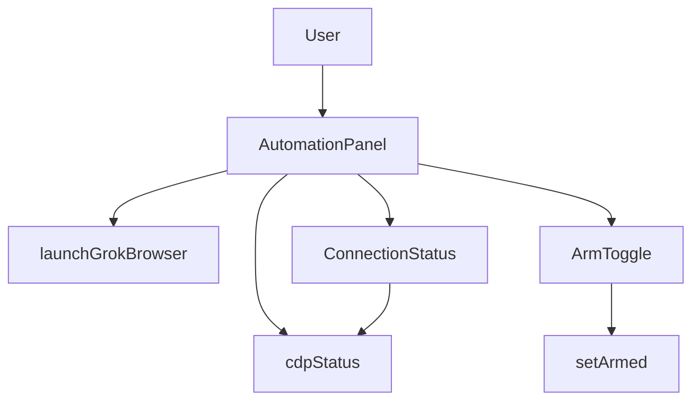
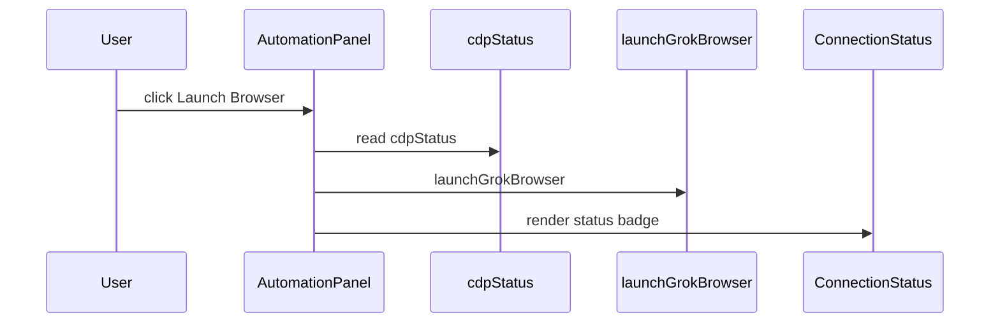
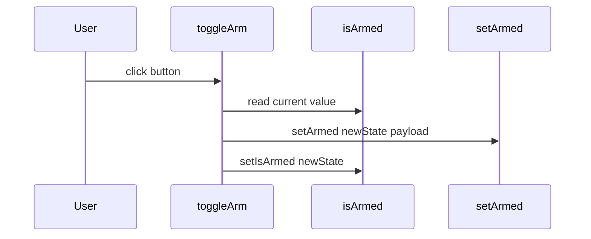

# Automation Control

*Source files: `src-desktop/src/components/AutomationControl/ArmToggle.tsx`, `src-desktop/src/components/AutomationControl/AutomationPanel.tsx`, `src-desktop/src/components/AutomationControl/ConnectionStatus.tsx`*

## Overview

The Automation Control area gives the user a compact desktop control strip for browser automation. It combines a browser launch action, a live connection indicator, and an arm or disarm toggle so the user can see the current browser state and change automation readiness from one place.

The three components are tightly focused on UI state and IPC-backed actions. `AutomationPanel` arranges the controls, `ConnectionStatus` reflects the shared `cdpStatus()` store, and `ArmToggle` owns a local armed state while calling `setArmed` through `../../ipc/automation`.

## Component Relationships

## Component Details

### `AutomationPanel`

ArmToggle contains a TODO comment that says the payload should come from the prompt UI and that the payload is empty for now, but the code currently sends JSON.stringify({ message: "test_payload" }) when arming and null when disarming. The comment does not match the executed payload.

*`src-desktop/src/components/AutomationControl/AutomationPanel.tsx`*

`AutomationPanel` is the container component for the automation strip. It renders the browser launch button, the live connection badge, and the arm toggle in a single flex layout.

| Control | Behavior |
| --- | --- |
| Launch Browser button | Calls `launchGrokBrowser()` on click. The button is disabled unless `cdpStatus() === "disconnected"`. Its cursor and opacity also follow that condition. |
| `ConnectionStatus` | Renders the browser connection badge and text. |
| `ArmToggle` | Renders the arm or disarm control. |

**Source-backed dependencies**

| Type | Description |
| --- | --- |
| `Component` | SolidJS component type. |
| `ConnectionStatus` | Child component used in the panel. |
| `ArmToggle` | Child component used in the panel. |
| `launchGrokBrowser` | Imported IPC action triggered by the Launch Browser button. |
| `cdpStatus` | Shared store read used to gate the button and style it. |

The container uses a horizontal layout with `display: "flex"`, `align-items: "center"`, `justify-content: "space-between"`, and a visible bottom border. The left side groups the launch button and connection status, while the right side contains `ArmToggle`.

### `ConnectionStatus`

*`src-desktop/src/components/AutomationControl/ConnectionStatus.tsx`*

`ConnectionStatus` is a pure display component. It reads `cdpStatus()` and converts the current browser state into a colored dot and a short label.

| `cdpStatus()` value | Dot class | Dot color | Label |
| --- | --- | --- | --- |
| `connected` | `bg-green-500` | `var(--accent-primary)` | Browser Connected |
| `connecting` | `bg-yellow-500` | `var(--warning)` | Connecting |
| `disconnected` | `bg-red-500` | `var(--danger)` | Browser Offline |

The status dot is a 12 by 12 pixel inline block with a circular border radius. The text uses `var(--text-secondary)` and sits beside the dot with a small right margin on the indicator.

**Source-backed dependencies**

| Type | Description |
| --- | --- |
| `Component` | SolidJS component type. |
| `cdpStatus` | Shared store read used for the badge state and label. |

### `ArmToggle`

*`src-desktop/src/components/AutomationControl/ArmToggle.tsx`*

`ArmToggle` is the local arm and disarm control. It uses `createSignal(false)` to keep a boolean `isArmed` state, flips that state on click, and sends the new state through `setArmed`.

| Item | Behavior |
| --- | --- |
| `isArmed` | Local signal initialized to `false`. It controls the button label and the button colors. |
| `toggleArm` | Async click handler that computes `newState`, derives `payload`, awaits `setArmed(newState, payload)`, and then calls `setIsArmed(newState)`. |
| `newState` | The negated value of `isArmed()` at click time. |
| `payload` | `JSON.stringify({ message: "test_payload" })` when arming, `null` when disarming. |

The button switches between two visible states:

- `🔴 ARMED` when `isArmed()` is true
- `⚪ SAFE` when `isArmed()` is false

Its styling also changes with the state. Armed mode uses `var(--danger)` for the background and `var(--text-primary)` for the text. Safe mode uses `var(--surface-light)` for the background and `var(--text-secondary)` for the text.

**Source-backed dependencies**

| Type | Description |
| --- | --- |
| `Component` | SolidJS component type. |
| `createSignal` | SolidJS signal creator used for the local armed state. |
| `setArmed` | Imported IPC action invoked with the next arm state and payload. |

## Feature Flows

### Launch Browser Flow

`AutomationPanel` only enables the launch button when `cdpStatus()` reports `disconnected`. `ConnectionStatus` reads the same store and keeps the status display aligned with the shared browser connection state.

### Arm Toggle Flow

The arm toggle is self-contained. It derives the next state from the current local signal, constructs the payload from that next state, sends both values through `setArmed`, and then updates the local signal so the button text and colors change immediately.

## State Management

| State source | Values | Used by |
| --- | --- | --- |
| `isArmed` | `false`, `true` | `ArmToggle` button label, background color, and text color. |
| `cdpStatus()` | `connected`, `connecting`, `disconnected` | `ConnectionStatus` label and dot styling, plus the Launch Browser button disabled state in `AutomationPanel`. |

`ArmToggle` uses component-local state for the armed flag, while `AutomationPanel` and `ConnectionStatus` both read the shared `cdpStatus()` store so they stay synchronized.

## Integration Points

- `../../ipc/automation`- `launchGrokBrowser`
- `setArmed`
- `../../stores/cdp`- `cdpStatus`
- `solid-js`- `Component`
- `createSignal`

## Key Files Reference

| File | Responsibility |
| --- | --- |
| `src-desktop/src/components/AutomationControl/AutomationPanel.tsx` | Renders the automation control strip and gates browser launch on `cdpStatus()`. |
| `src-desktop/src/components/AutomationControl/ConnectionStatus.tsx` | Displays the live browser connection badge from `cdpStatus()`. |
| `src-desktop/src/components/AutomationControl/ArmToggle.tsx` | Manages the local armed state and calls `setArmed` with the next state and payload. |
