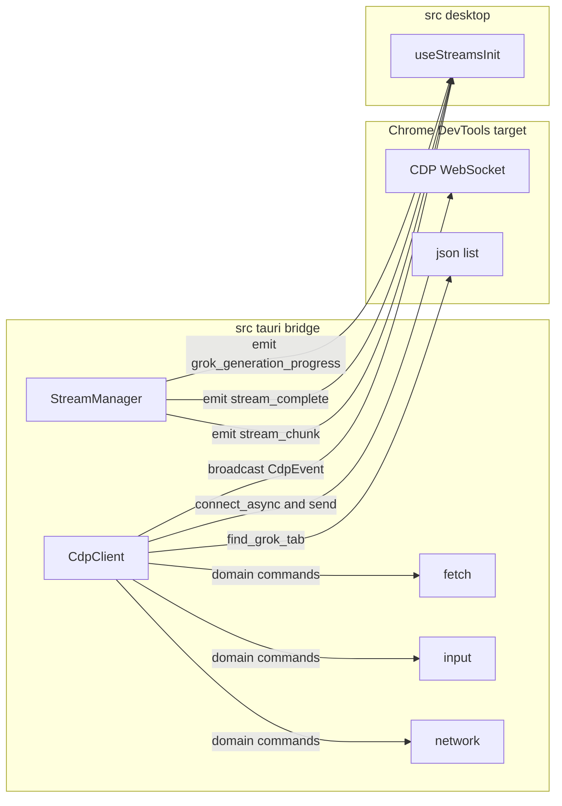

# Additional Source Areas - Bridge

## Overview

The bridge area is the app’s low-level connection layer to Chrome DevTools Protocol, not a public HTTP API. It connects the Tauri desktop runtime to a remote-debugging browser target, sends CDP commands for Fetch, Input, Network, Runtime, and Page domains, and turns incoming CDP messages into typed events for the rest of the app.

It also carries the stream orchestration path that feeds generation progress and completed media back into the desktop UI. In practice, this means the bridge is responsible for tab discovery, websocket command dispatch, DOM-driven input, request interception, cookie/header extraction, and event emission into Tauri and the desktop stream store.

## Architecture Overview

## Infrastructure Services

### WebSocket and CDP Transport

The transport service is centered on `CdpClient` in `src-tauri/src/bridge/cdp_client.rs`. `connect` opens the websocket with `connect_async(debugger_url)`, splits it into send and receive halves, creates a `broadcast::channel(100)` for incoming notifications, and starts `recv_loop` on a background task.

`send` uses `AtomicU64` to assign a monotonically increasing `id`, stores a `oneshot::Sender<Value>` in `pending`, sends a JSON frame over `ws_tx`, and waits for the matching response. `recv_loop` matches response frames by `id`, resolves the corresponding pending sender, and broadcasts notification frames as `CdpEvent` values.

### Application Event Bus

Two event paths are visible in this bridge area:

- `CdpClient.events` is a `broadcast::Sender<CdpEvent>` used for CDP notifications.
- `StreamManager` uses `tauri::Emitter` through `app_handle.emit` to publish app-level events:- `stream_complete`
- `stream_chunk`
- `grok_generation_progress`
- `new_media_generated`

The desktop consumer in `src-desktop/src/stores/streams.ts` subscribes through `onStreamChunk`, `onGenerationProgress`, and `onStreamComplete`, then updates `streamsStore` and calls `fetchGallery()` after completion.

### Logging

The bridge uses structured and console logging at the points where it matters operationally:

- `CdpClient.setup` logs when CDP domains are enabled and when Fetch patterns are registered.
- `input.click_selector` logs the selector and resolved coordinates before dispatching the click.

## Component Structure

### Cdp Event

*src-tauri/src/bridge/cdp_client.rs*

`CdpEvent` is the typed wrapper for CDP notification frames that arrive without a request `id`.

| Property | Type | Description |
| --- | --- | --- |
| `method` | `String` | CDP event name taken from the notification frame |
| `params` | `Value` | Cloned JSON params payload from the raw frame |

| Method | Description |
| --- | --- |
| `from_raw` | Builds a `CdpEvent` from a CDP method name and a `Value` reference by copying the method string and cloning the params object |

### CDP Client

*src-tauri/src/bridge/cdp_client.rs*

`CdpClient` owns the websocket sink, request correlation state, and notification broadcast channel.

| Property | Type | Description |
| --- | --- | --- |
| `ws_tx` | `Arc<Mutex<WsTx>>` | Serialized websocket sink used for outbound CDP frames |
| `pending` | `Arc<Mutex<HashMap<u64, oneshot::Sender<Value>>>>` | Request waiters keyed by CDP `id` |
| `events` | `broadcast::Sender<CdpEvent>` | Broadcast channel for notification-style CDP events |
| `id` | `AtomicU64` | Monotonic request identifier counter |

| Method | Description |
| --- | --- |
| `connect` | Connects to the debugger websocket at `debugger_url`, creates the broadcast channel and pending map, and spawns `recv_loop` |
| `setup` | Enables `Runtime`, `Network`, `Page`, and `Fetch`, adds `gvpStream` and `gvpStreamMeta` bindings, injects `PERFORMANCE_NEUTERING_JS` and `STREAM_INTERCEPTOR_JS`, and evaluates both scripts immediately in the current page |
| `send` | Sends a JSON CDP command frame with a unique `id`, stores a oneshot waiter, and awaits the matching `result` |
| `find_grok_tab` | Queries the local debugger list at `http://localhost:{CDP_PORT}/json/list`, selects the first tab whose URL contains `grok.com`, and returns its `webSocketDebuggerUrl` |

`setup` enables Fetch with these patterns:

- `*rest/app-chat*` at `Request` stage
- `*generate*` at `Request` stage

### CDP Domains Module

recv_loop recognizes Runtime.bindingCalled, but the branch only contains a comment and does not forward the binding payload into StreamManager inside this file. The wiring has to happen elsewhere in the orchestration path.

*src-tauri/src/bridge/cdp_domains/mod.rs*

This file is the namespace glue for the CDP domain helpers.

| Exported module | Role |
| --- | --- |
| `runtime` | Re-exported bridge module |
| `fetch` | Fetch domain helpers documented below |
| `input` | Input domain helpers documented below |
| `page` | Re-exported bridge module |
| `network` | Network domain helpers documented below |

### Fetch Domain Helpers

*src-tauri/src/bridge/cdp_domains/fetch.rs*

These helpers wrap Fetch-domain CDP commands and preserve the request payload in the shapes the protocol expects.

| Method | Description |
| --- | --- |
| `enable` | Sends `Fetch.enable` with the supplied `patterns` array |
| `continue_with_body` | Base64-encodes `post_data`, removes `content-length` from forwarded headers, and sends `Fetch.continueRequest` with `requestId`, `postData`, and filtered `headers` |
| `pass_through` | Sends `Fetch.continueRequest` with only `requestId` |
| `abort` | Sends `Fetch.failRequest` with `requestId` and `errorReason` set to `Aborted` |

`continue_with_body` only forwards headers that can be read as strings from the provided JSON object. It converts them to the `{ name, value }` shape expected by CDP.

### Input Domain Helpers

*src-tauri/src/bridge/cdp_domains/input.rs*

These helpers dispatch trusted mouse input through CDP and use DOM lookup to target elements by selector.

| Method | Description |
| --- | --- |
| `click` | Legacy wrapper that converts integer coordinates to `f64` and delegates to `click_at` |
| `click_at` | Sends `mouseMoved`, waits 50 milliseconds, then sends `mousePressed` and `mouseReleased` at the supplied coordinates with the left button and `clickCount` set to `1` |
| `click_selector` | Escapes the selector string, evaluates `document.querySelector`, computes the center of the element bounding rect, logs the resolved coordinates, and delegates to `click_at` |

### Network Domain Helpers

The doc comment on click_selector says it returns rect_json, but the success path actually returns the result of click_at, not the rectangle object.

*src-tauri/src/bridge/cdp_domains/network.rs*

These helpers cover request blocking, response body retrieval, and cookie extraction from CDP.

| Method | Description |
| --- | --- |
| `enable` | Sends `Network.enable` with `maxTotalBufferSize` set to `10_000_000` |
| `set_blocked_urls` | Sends `Network.setBlockedURLs` with the supplied `urls` array |
| `get_response_body` | Sends `Network.getResponseBody` for the supplied `requestId` |
| `get_cookies` | Calls `Network.getCookies`, then converts the returned cookie array into a single `name=value; ` string |

#### Golden Headers

*src-tauri/src/bridge/cdp_domains/network.rs*

`GoldenHeaders` normalizes a specific set of request headers pulled from CDP and can serialize them back into JSON with empty fields omitted.

| Property | Type | Description |
| --- | --- | --- |
| `cookie` | `String` | Required header captured from the source map |
| `authorization` | `String` | Optional header, defaulting to an empty string |
| `x_csrf_token` | `String` | Optional header, defaulting to an empty string |
| `x_grok_session` | `String` | Optional header, defaulting to an empty string |
| `x_statsig_id` | `String` | Optional header, defaulting to an empty string |
| `x_userid` | `String` | Optional header, defaulting to an empty string |
| `baggage` | `String` | Optional header, defaulting to an empty string |
| `sentry_trace` | `String` | Optional header, defaulting to an empty string |
| `traceparent` | `String` | Optional header, defaulting to an empty string |

| Method | Description |
| --- | --- |
| `from_headers` | Performs a case-insensitive lookup over `HashMap<String, String>`, requires `cookie`, and fills the remaining fields from matching header names when present |
| `to_json_value` | Serializes `GoldenHeaders` into a JSON object, always including `cookie` and omitting empty optional fields |

### Stream Manager

*src-tauri/src/bridge/stream_manager.rs*

`StreamManager` converts stream metadata and stream chunks into app events and persisted gallery records.

| Property | Type | Description |
| --- | --- | --- |
| `streams` | `Mutex<HashMap<String, StreamAccumulator>>` | In-memory accumulator map keyed by `streamId` |
| `app_handle` | `tauri::AppHandle` | Tauri handle used to emit app events |
| `db_pool` | `SqlitePool` | Database pool used for gallery upserts |

| Method | Description |
| --- | --- |
| `new` | Creates a `StreamManager` with an empty stream map, the provided `tauri::AppHandle`, and the provided `SqlitePool` |
| `on_meta` | Parses a JSON payload, and when `type` is `stream_start` creates a new `StreamAccumulator` with `streamId`, `parentId`, `url`, empty `lines`, current `started_at`, and `done` set to `false` |
| `on_chunk` | Parses a JSON payload, looks up the matching accumulator by `streamId`, handles `done`, emits `grok_generation_progress`, emits `stream_chunk`, and writes completed media records into the gallery database |

`on_chunk` has three notable branches:

- When `done` is `true`, it marks the accumulator complete and emits `stream_complete` with `streamId` and the accumulated `lines`.
- When parsed data contains `moderated`, it emits `grok_generation_progress` and upserts an `HmrRecord`.
- When parsed data reaches progress `100`, it emits `new_media_generated` and upserts either a `Video` or an `EditedImage` depending on the response payload.

#### Stream Accumulator

*src-tauri/src/bridge/stream_manager.rs*

`StreamAccumulator` holds the in-memory state for one active stream.

| Property | Type | Description |
| --- | --- | --- |
| `stream_id` | `String` | Active stream identifier |
| `parent_id` | `Option<String>` | Optional parent record identifier |
| `url` | `String` | Source URL captured from stream metadata |
| `lines` | `Vec<Value>` | Parsed stream lines accumulated over time |
| `started_at` | `std::time::Instant` | Start timestamp for the stream |
| `done` | `bool` | Terminal flag for the accumulator |

## State Management

The bridge keeps request and stream state in memory rather than in the UI layer.

- `CdpClient.pending` correlates outbound command `id` values with `oneshot::Sender<Value>` waiters.
- `CdpClient.id` increments atomically with `Ordering::SeqCst`.
- `StreamManager.streams` stores `StreamAccumulator` entries keyed by `streamId`.
- `StreamManager.on_chunk` short-circuits when a `streamId` does not exist, marks `done` when terminal data arrives, and avoids reprocessing completed streams.

## Integration Points

- `crate::automation::react_helpers` supplies `PERFORMANCE_NEUTERING_JS` and `STREAM_INTERCEPTOR_JS` for runtime injection.
- `crate::bridge::chrome_launcher::CDP_PORT` drives tab discovery in `find_grok_tab`.
- `src-desktop/src/stores/streams.ts` consumes `onStreamChunk`, `onGenerationProgress`, and `onStreamComplete`, then updates `streamsStore` and triggers `fetchGallery()`.
- `crate::db::gallery` receives `upsert_hmr_record`, `upsert_video`, and `upsert_edited_image` calls from `StreamManager`.

## Error Handling

The bridge consistently uses `anyhow::Result` for fallible operations and returns early on protocol or parsing failures.

- `connect`, `setup`, `send`, `find_grok_tab`, `enable`, `continue_with_body`, `pass_through`, `abort`, `click`, `click_at`, `click_selector`, `get_response_body`, `get_cookies`, `new`, `on_meta`, and `on_chunk` all propagate failures through `anyhow`.
- `click_selector` raises an error when the selector cannot be resolved or the element has zero size.
- `find_grok_tab` raises `Grok tab not found` when no matching debugger target is present.
- `recv_loop` ignores non-text websocket frames and silently drops malformed JSON frames.
- `on_chunk` returns `Ok(())` when no matching accumulator exists.

## Dependencies

The bridge uses the following concrete dependencies and services:

- `tokio_tungstenite` for websocket connection management.
- `futures_util` for `SinkExt` and `StreamExt` on the websocket halves.
- `tokio::sync::{Mutex, oneshot, broadcast}` for request correlation and event fan-out.
- `serde_json` for CDP frame construction and parsing.
- `base64` for body encoding in `continue_with_body`.
- `reqwest` for debugger target discovery in `find_grok_tab`.
- `tauri::Emitter` for app-level event emission.
- `SqlitePool` for gallery persistence from stream completion paths.
- `log` for operational bridge logging.
- `anyhow` for error propagation.