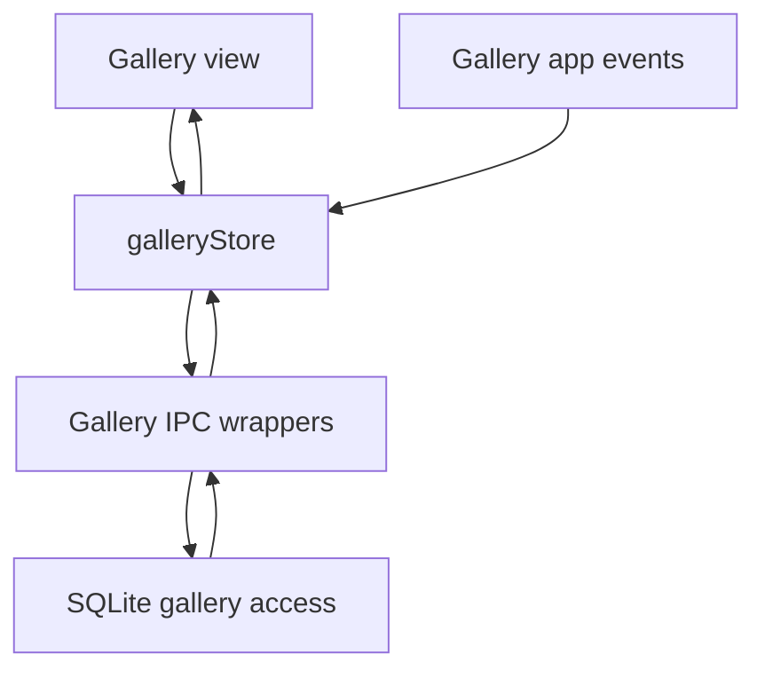
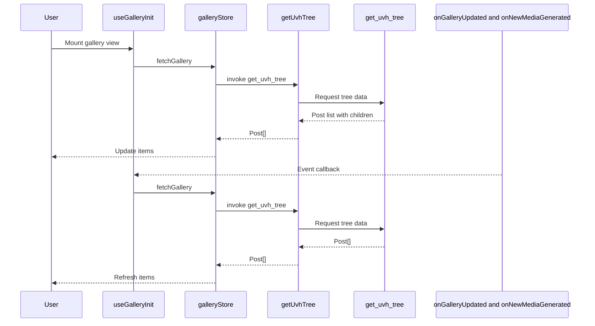

# Additional Source Areas - Gallery

## Overview

This gallery area is the desktop application’s source-backed path for loading, refreshing, and summarizing generated media. The frontend does not expose a public HTTP surface here; instead, it calls Tauri IPC commands with `invoke` and keeps gallery state in a SolidJS store.

The gallery data model is hierarchical. A `Post` contains its child `Video[]` and `EditedImage[]`, while `GenerationStats` aggregates totals across posts, videos, and edited images. The store fetches the tree on demand, reacts to gallery-related app events, and reloads when the active account changes through `accountUuid()`.

## Architecture Overview

## Tauri IPC Surface

### `src-desktop/src/ipc/gallery.ts`

No verified HTTP endpoint contract is documented for this section. The callable surface shown here is Tauri IPC plus local state and app-event refresh logic.

*src-desktop/src/ipc/gallery.ts*

This file defines the gallery-facing IPC contract used by the desktop app. Each function is a thin wrapper over `invoke`, and each returned type is already shaped for the SolidJS store and gallery views.

#### IPC Functions

| Method | Description | Returns |
| --- | --- | --- |
| `getUvhTree` | Calls `invoke("get_uvh_tree")` and fetches the full gallery tree of posts with child media. | `Promise<Post[]>` |
| `getGenerationHistory` | Calls `invoke("get_generation_history")` and returns generation log entries as an untyped array. | `Promise<unknown[]>` |
| `getGenerationStats` | Calls `invoke("get_generation_stats")` and returns aggregate counts for the gallery. | `Promise<GenerationStats>` |
| `forceGallerySync` | Calls `invoke("force_gallery_sync")` to force a full gallery re-sync from the local database. | `Promise<void>` |
| `syncGalleryFromListApi` | Calls `invoke("sync_gallery_from_list_api")` to sync gallery data from a Grok `/list` API response. | `Promise<void>` |
| `warmCache` | Calls `invoke("warm_cache")` to warm the gallery cache. | `Promise<void>` |

These wrappers do not transform payloads beyond the typed `invoke` call. The frontend relies on the returned shapes directly in the gallery store.

## Gallery State Store

### `src-desktop/src/stores/gallery.ts`

*src-desktop/src/stores/gallery.ts*

This store owns the gallery list shown by the UI. It keeps three state fields: the loaded items, a loading flag, and an error string. The store refreshes data through `getUvhTree`, then republishes the tree through `galleryStore`.

#### State Model

##### `GalleryState`

| Property | Type |
| --- | --- |
| `items` | `Post[]` |
| `loading` | `boolean` |
| `error` | `string \ | null` |

#### Store Behavior

| Function | Description |
| --- | --- |
| `fetchGallery` | Sets `loading` to `true`, clears `error`, calls `getUvhTree`, writes the returned tree into `items`, captures any thrown error message, and always clears `loading` in `finally`. |
| `useGalleryInit` | Registers event listeners on mount, refreshes the gallery when the active account changes, and removes listeners on cleanup. |

`fetchGallery` is the central refresh path. It does not partially merge data; it replaces `items` with the latest tree returned from the backend.

### App Events

`useGalleryInit` subscribes to two gallery refresh events:

- `onGalleryUpdated`
- `onNewMediaGenerated`

Both listeners call `fetchGallery()` when triggered. The hook also calls `fetchGallery()` inside `createEffect` after reading `accountUuid()`, so account changes force a reload even if no app event fires.

#### Gallery Refresh Flow

#### Error Handling

`fetchGallery` stores a readable error string in `galleryStore.error`. If the thrown value is an `Error`, it uses `e.message`; otherwise it falls back to `String(e)`. The loading flag is cleared in the `finally` block, so the UI can leave the loading state even when the request fails.

## Local Database Access

### `src-tauri/src/db/gallery.rs`

*src-tauri/src/db/gallery.rs*

This file contains the database-side gallery queries and upserts. It uses `SqlitePool` and the schema types imported from `super::schema`.

#### Query and Upsert Functions

| Function | Description | Returns |
| --- | --- | --- |
| `get_posts_by_account` | Fetches posts for a specific account, or `NULL`-account posts when `account_id` is `None`, ordered by `created_at` descending. | `Result<Vec<Post>, sqlx::Error>` |
| `get_all_posts_legacy` | Fetches all posts regardless of account, ordered by `created_at` descending. | `Result<Vec<Post>, sqlx::Error>` |
| `get_videos_for_post` | Fetches videos for a given post id, ordered by `created_at` descending. | `Result<Vec<Video>, sqlx::Error>` |
| `get_edited_images_for_post` | Fetches edited images for a given post id, ordered by `created_at` descending. | `Result<Vec<EditedImage>, sqlx::Error>` |
| `upsert_post` | Inserts or updates a row in `posts` on `image_id` conflict. The update path refreshes `account_id`, `image_url`, `thumbnail_url`, `title`, `imagine_prompt`, and `updated_at`. | `Result<(), sqlx::Error>` |
| `upsert_video` | Inserts or updates a row in `videos` on `id` conflict. The update path refreshes `post_id`, `url`, `thumbnail_url`, `prompt`, `title`, and `gen_info`. | `Result<(), sqlx::Error>` |
| `upsert_edited_image` | Inserts or updates a row in `edited_images` on `id` conflict. The update path refreshes `post_id`, `url`, `thumbnail_url`, `prompt`, `title`, and `gen_info`. | `Result<(), sqlx::Error>` |
| `upsert_hmr_record` | Inserts or updates a row in `hmr` on `moderated_id` conflict. The update path refreshes `last_clean_progress` and `last_moderated_at`. | `Result<(), sqlx::Error>` |

#### Tree and Aggregate Queries

| Function | Description | Returns |
| --- | --- | --- |
| `get_uvh_tree` | Builds the full UVH tree for an account by loading posts, then loading videos and edited images for each post and assembling `PostWithChildren`. | `Result<Vec<PostWithChildren>, sqlx::Error>` |
| `get_generation_history` | Fetches generation log entries for an account, or `NULL`-account entries when `account_id` is `None`, ordered by `created_at` descending. | `Result<Vec<GenerationLogEntry>, sqlx::Error>` |
| `get_generation_stats` | Computes `total_posts`, `total_videos`, and `total_edited_images` for an account and returns them as `GenerationStats`. | `Result<GenerationStats, sqlx::Error>` |
| `get_config_history` | Fetches configuration history ordered by `timestamp` descending. | `Result<Vec<ConfigHistoryEntry>, sqlx::Error>` |

`get_generation_stats` performs three count queries and returns the totals directly:

- `total_posts` from `posts.0`
- `total_videos` from `videos.0`
- `total_edited_images` from `edited.0`

The UVH tree builder is the only function here that composes multiple queries into a nested shape. It reuses `get_posts_by_account`, `get_videos_for_post`, and `get_edited_images_for_post` to produce one gallery-ready structure per post.

## Key Interfaces and Functions Reference

| Name | Location | Responsibility |
| --- | --- | --- |
| `Post` | `src-desktop/src/ipc/gallery.ts` | Top-level gallery item with nested videos and edited images. |
| `Video` | `src-desktop/src/ipc/gallery.ts` | Child media item for a post. |
| `EditedImage` | `src-desktop/src/ipc/gallery.ts` | Child edited image item for a post. |
| `GenerationStats` | `src-desktop/src/ipc/gallery.ts` | Aggregate gallery totals. |
| `GalleryState` | `src-desktop/src/stores/gallery.ts` | Store state for gallery loading, errors, and items. |
| `fetchGallery` | `src-desktop/src/stores/gallery.ts` | Loads gallery data and updates `galleryStore`. |
| `useGalleryInit` | `src-desktop/src/stores/gallery.ts` | Mount-time subscription and account-change refresh hook. |
| `get_uvh_tree` | `src-tauri/src/db/gallery.rs` | Backend tree assembly path used by the gallery fetch flow. |
| `get_generation_stats` | `src-tauri/src/db/gallery.rs` | Backend aggregate query for gallery totals. |
