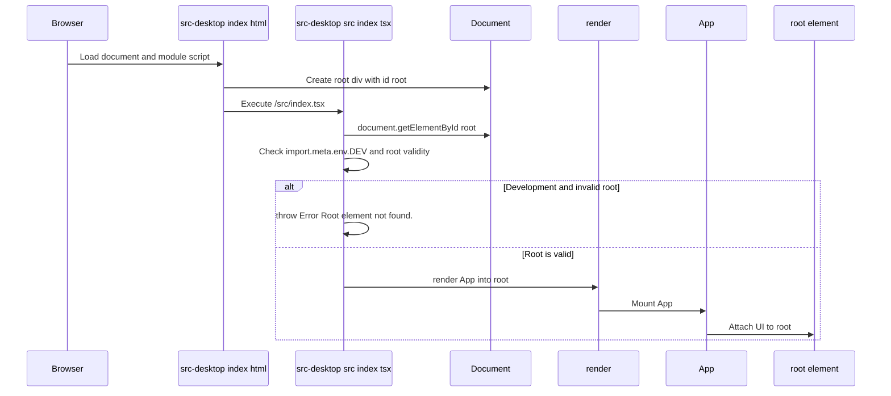

# Additional Source Areas - Index

## Overview

This source area defines the desktop app’s browser entrypoint and the HTML shell that loads it. `src-desktop/index.html` provides the document scaffold, mounts the root DOM node, and pulls in the SolidJS module entry at `/src/index.tsx`.

`src-desktop/src/index.tsx` is the client bootstrap file. It verifies that the `root` element exists in development, imports the global stylesheet, and renders the imported `App` component into the document.

## Source Files

| File | Role | Verified Responsibilities |
| --- | --- | --- |
| `src-desktop/index.html` | HTML shell | Declares the document language and dark theme class, sets metadata, loads Google Fonts, creates the `root` mount point, and loads `/src/index.tsx` as a module script. |
| `src-desktop/src/index.tsx` | Client entrypoint | Imports `render` from `solid-js/web`, imports `App` from `./App`, imports `./styles/global.css`, looks up `root` with `document.getElementById('root')`, throws `Error('Root element not found.')` in development when the mount point is invalid, and renders `App` into `root`. |

## Browser Shell

### `src-desktop/index.html`

*File path: `src-desktop/index.html`*

This file is the first browser-visible layer of the desktop application. It sets `<html lang="en" class="dark">`, which establishes the language metadata and applies the dark class at the document root before the client application mounts.

It also defines the page metadata and external presentation resources:

- `<meta charset="UTF-8" />`
- `<meta name="viewport" content="width=device-width, initial-scale=1.0" />`
- `<title>Aetheris - Gallery</title>`
- Google Fonts links for `Inter`, `JetBrains Mono`, and Material Symbols Outlined

The application mount point is a single `

`. The only JavaScript entry referenced by the page is ``.

## Client Entry

### `src-desktop/src/index.tsx`

*File path: `src-desktop/src/index.tsx`*

This file is the SolidJS bootstrapping layer. It imports:

- `render` from `solid-js/web`
- `App` from `./App`
- `./styles/global.css`

The entry logic is minimal and direct:

- `const root = document.getElementById('root');`
- In development mode, if `root` is not an `HTMLElement`, it throws `Error('Root element not found.')`
- It renders the application with `render(() => <App />, root!);`

The `root!` assertion shows that the render call expects the mount node to exist once the development guard has passed.

## Startup Flow

### Startup Behavior

1. The browser loads the document from `src-desktop/index.html`.
2. The document creates the `root` mount point and loads the module entry from `/src/index.tsx`.
3. `src-desktop/src/index.tsx` locates `#root`.
4. In development, invalid or missing root markup fails fast with `Error('Root element not found.')`.
5. The SolidJS `render` call mounts `App` into the root node.

## Runtime Dependencies

- `solid-js/web` provides the `render` entry used to mount the app.
- `./styles/global.css` is loaded by the entrypoint to apply shared styling.
- Google Fonts resources are loaded directly from the HTML shell.
- `App` is the rendered application component imported from `./App`.

## Integration Points

- The HTML shell and the TSX bootstrap are linked by the `/src/index.tsx` module script.
- The bootstrapped app depends on the `root` element existing in `src-desktop/index.html`.
- The document-level `dark` class is present before the app renders, so the client starts from a dark-rooted document state.

## Key Files Reference

| File | Location | Responsibility |
| --- | --- | --- |
| `index.html` | `src-desktop/index.html` | Defines the document shell, metadata, font links, mount point, and module entry script. |
| `index.tsx` | `src-desktop/src/index.tsx` | Performs root lookup, validates the mount target in development, imports global styles, and renders `App`. |
