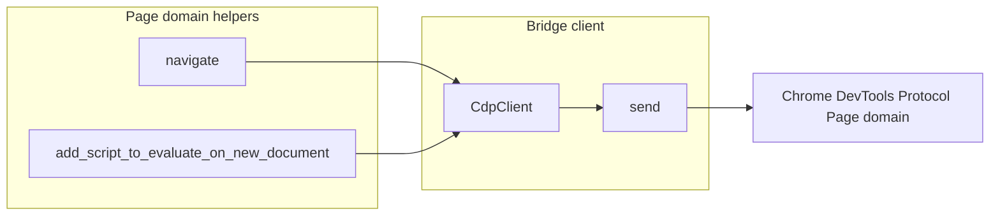
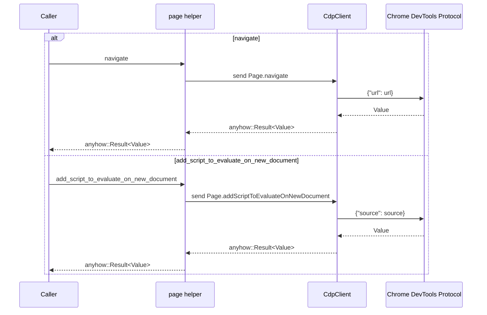

# Page

*`src-tauri/src/bridge/cdp_domains/page.rs`*

## Overview

This file provides a small bridge layer for the Chrome DevTools Protocol Page domain. It does not expose a public HTTP surface; instead, it turns Rust calls into CDP messages sent through `crate::bridge::cdp_client::CdpClient`.

The module contains two async helper functions: one for navigation and one for registering a script that runs before new documents load. Both helpers build a JSON payload inline with `serde_json::json`, send a fixed Page-domain command string, and return the raw `Value` produced by the bridge client.

## Architecture Overview

## Public Functions

| Function | Description | Input | CDP command | Payload key | Returns |
| --- | --- | --- | --- | --- | --- |
| `navigate` | Sends a Page navigation request through the bridge client. | `&CdpClient`, `&str` | `Page.navigate` | `url` | `anyhow::Result<Value>` |
| `add_script_to_evaluate_on_new_document` | Registers script source to run on newly created documents through the bridge client. | `&CdpClient`, `&str` | `Page.addScriptToEvaluateOnNewDocument` | `source` | `anyhow::Result<Value>` |

### Function behavior

- `navigate` calls `client.send("Page.navigate", json!({ "url": url }))`.
- `add_script_to_evaluate_on_new_document` calls `client.send("Page.addScriptToEvaluateOnNewDocument", json!({ "source": source }))`.
- Both functions await the bridge call directly and return the client result without additional transformation.

## CdpClient Bridge Dependency

`crate::bridge::cdp_client::CdpClient` is the only injected dependency in this file. The helpers borrow it by reference, which means they reuse an already established bridge client rather than constructing one themselves.

| Type | Description |
| --- | --- |
| `crate::bridge::cdp_client::CdpClient` | Bridge client passed into both helpers and used to send Page-domain commands. |
| `serde_json::{json, Value}` | `json` builds the request payloads inline, and `Value` carries the result returned by `client.send`. |

### Call flow

1. A caller provides an existing `&CdpClient`.
2. The helper builds a one-field JSON object with either `url` or `source`.
3. The helper invokes `client.send` with a fixed Page-domain command string.
4. The returned `Value` is wrapped in `anyhow::Result<Value>` and propagated to the caller.

## Error Handling

Both functions return `anyhow::Result<Value>`. The file does not add its own branching or recovery path; any error produced by `client.send.await` is propagated to the caller through the returned result.

That makes the bridge behavior straightforward for upstream code: the caller receives either the CDP response value or the underlying failure from the client call.

## Dependencies

| Dependency | Role in this file |
| --- | --- |
| `crate::bridge::cdp_client::CdpClient` | Sends the actual Page-domain messages. |
| `serde_json::json` | Builds the JSON request bodies inline. |
| `serde_json::Value` | Represents the response returned by the client. |
| `anyhow::Result` | Wraps the async return value for error propagation. |

## Key Files Reference

| File | Responsibility |
| --- | --- |
| `src-tauri/src/bridge/cdp_domains/page.rs` | Defines the Page-domain bridge helpers `navigate` and `add_script_to_evaluate_on_new_document`. |
