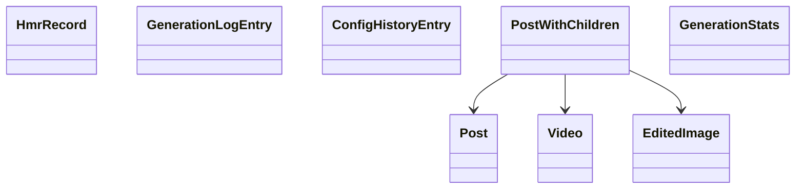

# Schema

## Overview

This module defines the Rust data shapes that back the desktop application's database layer. The table-mirroring structs are built with `serde::{Deserialize, Serialize}` for serialization and `sqlx::FromRow` for row mapping, so they can move directly between database queries and serialized application data.

The file covers six table-backed records plus two composite shapes. `PostWithChildren` combines a `Post` with its child `videos` and `edited_images`, and `GenerationStats` provides summarized totals for the schema’s core media collections.

## Relationship View

## Database-Mirrored Records

### Post

`Post` mirrors the `posts` table.

| Property | Type |
| --- | --- |
| `image_id` | `String` |
| `account_id` | `Option<String>` |
| `image_url` | `Option<String>` |
| `thumbnail_url` | `Option<String>` |
| `title` | `Option<String>` |
| `imagine_prompt` | `Option<String>` |
| `created_at` | `Option<i64>` |
| `updated_at` | `Option<String>` |
| `last_accessed` | `Option<String>` |
| `last_moderated_at` | `Option<String>` |
| `last_successful_at` | `Option<String>` |

### Edited Image

`EditedImage` mirrors the `edited_images` table.

| Property | Type |
| --- | --- |
| `id` | `String` |
| `post_id` | `String` |
| `original_post_id` | `Option<String>` |
| `url` | `String` |
| `thumbnail_url` | `Option<String>` |
| `prompt` | `Option<String>` |
| `title` | `Option<String>` |
| `gen_info` | `Option<String>` |
| `created_at` | `Option<i64>` |

### Video

`Video` mirrors the `videos` table.

| Property | Type |
| --- | --- |
| `id` | `String` |
| `post_id` | `String` |
| `original_post_id` | `Option<String>` |
| `url` | `String` |
| `thumbnail_url` | `Option<String>` |
| `prompt` | `Option<String>` |
| `title` | `Option<String>` |
| `gen_info` | `Option<String>` |
| `duration` | `Option<i64>` |
| `resolution` | `Option<String>` |
| `is_extension` | `Option<i64>` |
| `extension_true_id` | `Option<String>` |
| `created_at` | `Option<i64>` |

### Hmr Record

`HmrRecord` mirrors the `hmr` table, described in the source comment as moderation records.

| Property | Type |
| --- | --- |
| `moderated_id` | `String` |
| `account_id` | `Option<String>` |
| `image_id` | `String` |
| `original_post_id` | `Option<String>` |
| `image_url` | `Option<String>` |
| `thumbnail_url` | `Option<String>` |
| `webapp_url` | `Option<String>` |
| `generation_type` | `Option<String>` |
| `title` | `Option<String>` |
| `prompt` | `Option<String>` |
| `mode` | `Option<String>` |
| `gen_info` | `Option<String>` |
| `moderated` | `Option<i64>` |
| `last_clean_progress` | `Option<i64>` |
| `last_moderated_at` | `Option<String>` |
| `last_accessed` | `Option<String>` |
| `created_at` | `Option<String>` |
| `updated_at` | `Option<String>` |

### Generation Log Entry

`GenerationLogEntry` mirrors the `generation_log` table.

| Property | Type |
| --- | --- |
| `id` | `String` |
| `target_id` | `String` |
| `generation_type` | `Option<String>` |
| `prompt` | `Option<String>` |
| `status` | `Option<String>` |
| `result_id` | `Option<String>` |
| `result_url` | `Option<String>` |
| `source` | `Option<String>` |
| `created_at` | `Option<i64>` |
| `account_id` | `Option<String>` |

### Config History Entry

`ConfigHistoryEntry` mirrors the `config_history` table.

| Property | Type |
| --- | --- |
| `id` | `i64` |
| `timestamp` | `Option<i64>` |
| `url` | `Option<String>` |
| `raw` | `Option<String>` |

## Composite Shapes

### Post With Children

PostWithChildren uses #[serde(flatten)] on post, so the Post fields are serialized alongside videos and edited_images in one nested aggregate shape.

`PostWithChildren` represents a `Post` plus its related child media.

| Property | Type |
| --- | --- |
| `post` | `Post` |
| `videos` | `Vec<Video>` |
| `edited_images` | `Vec<EditedImage>` |

### Generation Stats

`GenerationStats` provides an aggregate count view over the schema’s core collections.

| Property | Type |
| --- | --- |
| `total_posts` | `i64` |
| `total_videos` | `i64` |
| `total_edited_images` | `i64` |

## Serialization and Row Mapping

The module uses two shared Rust data traits across the schema types:

| Dependency | Role |
| --- | --- |
| `serde::{Deserialize, Serialize}` | Enables serialization and deserialization for the schema structs |
| `sqlx::FromRow` | Maps database rows into `Post`, `EditedImage`, `Video`, `HmrRecord`, `GenerationLogEntry`, and `ConfigHistoryEntry` |

The table-backed records all derive `Debug`, `Clone`, `Serialize`, `Deserialize`, and `FromRow`. The aggregate shapes `PostWithChildren` and `GenerationStats` derive `Debug`, `Clone`, `Serialize`, and `Deserialize` for serialized output.

## Key Classes Reference

| Class | Location | Responsibility |
| --- | --- | --- |
| `Post` | `src-tauri/src/db/schema.rs` | Row model for `posts` |
| `EditedImage` | `src-tauri/src/db/schema.rs` | Row model for `edited_images` |
| `Video` | `src-tauri/src/db/schema.rs` | Row model for `videos` |
| `HmrRecord` | `src-tauri/src/db/schema.rs` | Row model for `hmr` moderation records |
| `GenerationLogEntry` | `src-tauri/src/db/schema.rs` | Row model for `generation_log` |
| `ConfigHistoryEntry` | `src-tauri/src/db/schema.rs` | Row model for `config_history` |
| `PostWithChildren` | `src-tauri/src/db/schema.rs` | Flattened aggregate combining `Post` with child `videos` and `edited_images` |
| `GenerationStats` | `src-tauri/src/db/schema.rs` | Summary totals for posts, videos, and edited images |
