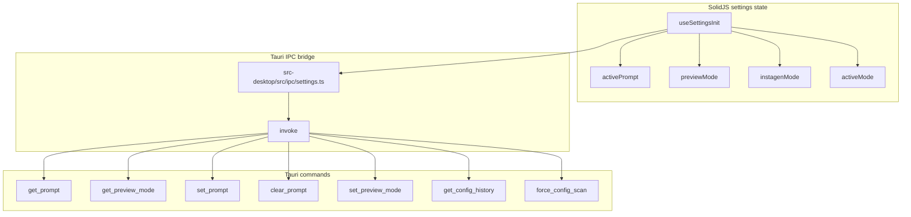
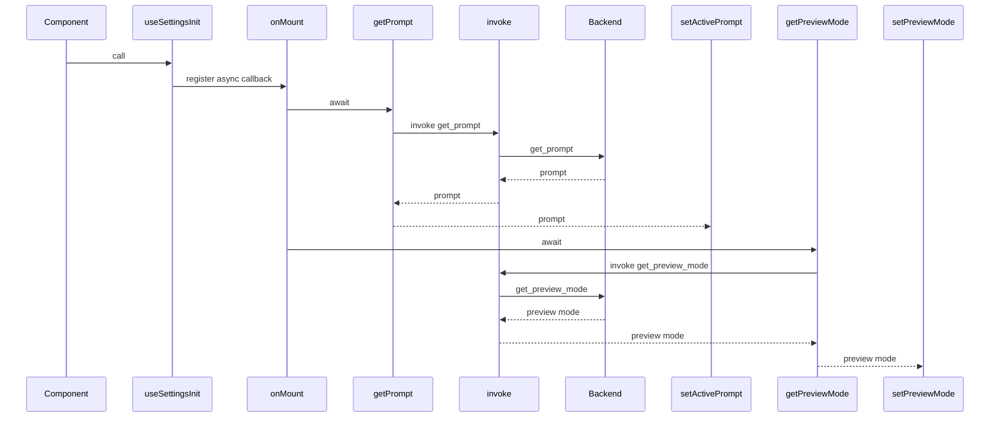

# Additional Source Areas - Setting

## Overview

*`src-desktop/src/ipc/settings.ts`*

*`src-desktop/src/stores/settings.ts`*

This area implements the desktop app’s settings path as a Tauri IPC bridge plus a SolidJS store. From the user’s point of view, it lets the app load the current prompt and preview mode when a component mounts, and it exposes commands for setting, clearing, and rescanning configuration state.

There is no public HTTP surface here. All backend interaction goes through `invoke` in `src-desktop/src/ipc/settings.ts`, and the store in `src-desktop/src/stores/settings.ts` hydrates local signals from those IPC calls.

## Architecture Overview

## IPC Settings

*`src-desktop/src/ipc/settings.ts`*

This module is the command wrapper layer for settings-related Tauri calls. Each function maps directly to a string command name passed to `invoke`, and the payload shape is explicit where a command needs one.

| Method | Description |
| --- | --- |
| `setPrompt` | Calls `invoke<void>("set_prompt", { prompt })` to update the active prompt text. Returns `Promise<void>`. |
| `getPrompt` | Calls `invoke<string>("get_prompt")` to read the current active prompt. Returns `Promise<string>`. |
| `clearPrompt` | Calls `invoke<void>("clear_prompt")` to clear the active prompt. Returns `Promise<void>`. |
| `setPreviewMode` | Calls `invoke<void>("set_preview_mode", { enabled })` to toggle preview mode. Returns `Promise<void>`. |
| `getPreviewMode` | Calls `invoke<boolean>("get_preview_mode")` to read preview mode state. Returns `Promise<boolean>`. |
| `getConfigHistory` | Calls `invoke<unknown[]>("get_config_history")` to fetch configuration change history. Returns `Promise<unknown[]>`. |
| `forceConfigScan` | Calls `invoke<void>("force_config_scan")` to trigger a configuration scan. Returns `Promise<void>`. |

### Command payloads

- `set_prompt` receives `{ prompt }`
- `set_preview_mode` receives `{ enabled }`
- `get_prompt`, `clear_prompt`, `get_preview_mode`, `get_config_history`, and `force_config_scan` are invoked without a payload object

## Settings Store

*`src-desktop/src/stores/settings.ts`*

This module keeps the UI-facing settings state in module-level SolidJS signals. It exports both the signal accessors and their setters, plus `useSettingsInit`, which runs the backend hydration when a component mounts.

### State values

| Name | Source type | Initial value | Description |
| --- | --- | --- | --- |
| `activePrompt` | `string` | `""` | Holds the current prompt loaded from `getPrompt()`. |
| `previewMode` | `boolean` | `false` | Tracks preview mode state loaded from `getPreviewMode()`. |
| `instagenMode` | `boolean` | `false` | Additional boolean signal exported by the store. |
| `activeMode` | `'video' \ | 'image'` | `'image'` | Tracks the active mode signal with a two-value union. |

### Exported setters

| Name | Updates |
| --- | --- |
| `setActivePrompt` | Updates `activePrompt`. |
| `setPreviewMode` | Updates `previewMode`. |
| `setInstagenMode` | Updates `instagenMode`. |
| `setActiveMode` | Updates `activeMode`. |

### Hook

| Method | Description |
| --- | --- |
| `useSettingsInit` | Registers an `onMount` callback that loads initial settings from the backend. It awaits `getPrompt()` and `getPreviewMode()`, then writes their results into `activePrompt` and `previewMode`. Returns `void`. |

### Initialization flow

1. A component calls `useSettingsInit()`.
2. `onMount` registers an async initialization callback.
3. The callback calls `getPrompt()` and writes the result to `setActivePrompt`.
4. The callback calls `getPreviewMode()` and writes the result to `setPreviewMode`.
5. Each backend call is wrapped in its own `try` block, so one failure does not stop the other hydration step.

## Error Handling

The store uses separate `try` blocks for the two hydration calls. If `getPrompt()` throws, the code keeps the existing empty-string default from `createSignal<string>("")`. If `getPreviewMode()` throws, the code keeps the existing `false` default from `createSignal<boolean>(false)`.

The inline comments in the source document the intended fallback behavior:

- backend state may not exist yet, so `activePrompt` stays empty
- preview mode defaults to `false` when the backend lookup fails

## State Management

- `activePrompt`, `previewMode`, `instagenMode`, and `activeMode` are module-level signals created with `createSignal`
- `useSettingsInit` only hydrates `activePrompt` and `previewMode`
- `setActivePrompt`, `setPreviewMode`, `setInstagenMode`, and `setActiveMode` are exported for direct updates from components or other store consumers
- `activeMode` is constrained to `'video' | 'image'` and starts as `'image'`

## Supporting Configuration

| File | Source-backed role | Notable details |
| --- | --- | --- |
| `package.json` | Root package metadata for the repository | `name` is `groktop`, `main` is `index.js`, and `devDependencies` includes `@tauri-apps/cli`. |
| `src-desktop/package.json` | Desktop app package metadata | Defines `dev`, `build`, `serve`, and `tauri` scripts; depends on `@tauri-apps/api` and `solid-js`; uses `typescript`, `vite`, and `vite-plugin-solid` for development. |
| `src-desktop/tsconfig.json` | TypeScript compiler configuration for the desktop app | Enables `strict`, targets `ESNext`, uses `module` `ESNext`, `moduleResolution` `node`, `jsx` `preserve`, `jsxImportSource` `solid-js`, and `types` `["vite/client"]`. |
| `src-tauri/Cargo.toml` | Rust-side Tauri application manifest | Declares `app` and `app_lib`, uses `tauri` with `devtools`, and includes `tauri-plugin-store`, `tauri-plugin-log`, `tokio`, `tokio-tungstenite`, `reqwest`, `sqlx`, `serde`, `serde_json`, `simd-json`, `notify`, `parking_lot`, `anyhow`, `tracing`, `tracing-subscriber`, `tracing-appender`, `base64`, and `futures-util`. |
| `src-tauri/capabilities/default.json` | Default desktop capability set | Identifies the capability as `default`, applies it to window `main`, and grants `core:default`. |
| `src-tauri/tauri.conf.json` | Tauri app shell configuration | Sets `productName` to `groktop`, `version` to `0.1.0`, `identifier` to `com.tauri.dev`, uses `frontendDist` `../src-desktop/dist`, `devUrl` `http://localhost:3000`, `beforeDevCommand` `npm --prefix src-desktop run dev`, and `beforeBuildCommand` `npm --prefix src-desktop run build`. The app window title is `Aetheris`, and bundling is enabled with the listed icon assets. |

## Dependencies and Integration Points

- `solid-js`: `createSignal` and `onMount` in `src-desktop/src/stores/settings.ts`
- `@tauri-apps/api/core`: `invoke` in `src-desktop/src/ipc/settings.ts`
- Tauri command names consumed by the desktop layer: `set_prompt`, `get_prompt`, `clear_prompt`, `set_preview_mode`, `get_preview_mode`, `get_config_history`, `force_config_scan`
- App shell and permission setup: `src-tauri/tauri.conf.json` and `src-tauri/capabilities/default.json`

## Key Files Reference

| File | Responsibility |
| --- | --- |
| `src-desktop/src/ipc/settings.ts` | Wraps settings-related Tauri command calls. |
| `src-desktop/src/stores/settings.ts` | Holds settings state and hydrates it on mount. |
| `src-desktop/package.json` | Defines the desktop app scripts and frontend dependencies. |
| `src-desktop/tsconfig.json` | Configures the TypeScript compiler for the SolidJS desktop app. |
| `src-tauri/Cargo.toml` | Declares the Rust-side Tauri runtime and plugins. |
| `src-tauri/capabilities/default.json` | Grants the default app capability permissions. |
| `src-tauri/tauri.conf.json` | Configures app identity, build commands, window settings, and bundling. |
