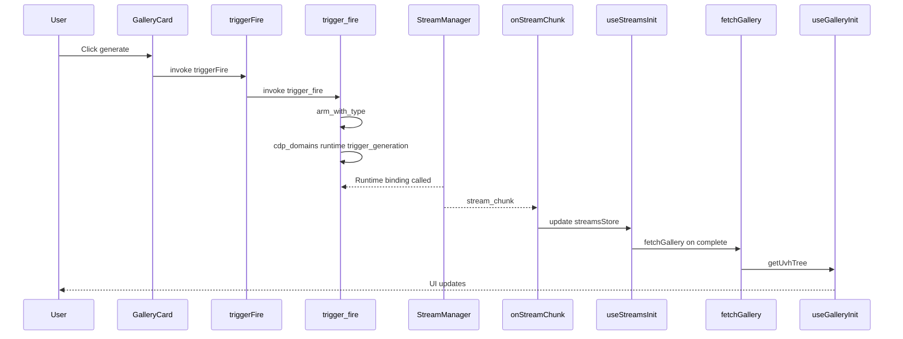

# No Public API Endpoints

## Public API Surface Assessment

This repository does not implement a developer-facing HTTP API service. The callable surface is a Tauri desktop app surface made of `#[tauri::command]` handlers in `src-tauri/src/commands/mod.rs`, desktop IPC wrappers in `src-desktop/src/ipc/*.ts`, and app events consumed by SolidJS stores in `src-desktop/src/stores/*.ts`.

The backend modules under `src-tauri/src/bridge/`, `src-tauri/src/db/`, and `src-tauri/src/automation/` support browser automation, CDP interception, local SQLite persistence, and event emission. They are internal application services, not public route registrations or server routers.

### Surface Assessment

| Area | Files | Assessment |
| --- | --- | --- |
| Desktop IPC commands | `src-desktop/src/ipc/automation.ts`, `src-desktop/src/ipc/gallery.ts`, `src-desktop/src/ipc/settings.ts` | Frontend `invoke` wrappers that call Tauri commands inside the bundled desktop app |
| App events | `src-desktop/src/ipc/events.ts` | Frontend event listeners for Tauri-emitted messages |
| Backend command handlers | `src-tauri/src/commands/mod.rs` | `#[tauri::command]` callable surface for the desktop client |
| Browser and CDP bridge | `src-tauri/src/bridge/mod.rs`, `src-tauri/src/bridge/cdp_domains/mod.rs`, `src-tauri/src/bridge/stream_manager.rs`, `src-tauri/src/bridge/cdp_domains/network.rs` | Internal automation, interception, and event bridge logic |
| Local persistence | `src-tauri/src/db/mod.rs`, `src-tauri/src/db/pool.rs`, `src-tauri/src/db/schema.rs`, `src-tauri/src/db/gallery.rs` | SQLite-backed storage and query helpers |
| Automation helpers | `src-tauri/src/automation/mod.rs`, `src-tauri/src/payload_builder.rs` | Internal payload construction and automation support |

### Desktop Command Flow

## Desktop IPC Command Surface

### `src-desktop/src/ipc/automation.ts`

src-tauri/src/commands/mod.rs makes outbound requests to https://grok.com/rest/media/post/list and performs a CDP-driven HEAD fetch against /imagine/saved. Those calls consume Grok services from the desktop client; they are not endpoints served by this repository.

*File path: `src-desktop/src/ipc/automation.ts`*

This file is the frontend wrapper for the main desktop automation commands. Every function calls `invoke`, so the surface is Tauri IPC, not HTTP.

#### App Status

| Property | Type | Description |
| --- | --- | --- |
| `status` | `string` | Current app status string |
| `cdp_connected` | `boolean` | CDP connection state |
| `browser_launched` | `boolean` | Browser launch state |

#### Command Wrappers

| Method | Description |
| --- | --- |
| `launchGrokBrowser` | Invokes `launch_grok_browser` to start Chrome and attach CDP |
| `getStatus` | Invokes `get_status` and returns `AppStatus` |
| `triggerFire` | Invokes `trigger_fire` with a generation payload |
| `triggerFastgen` | Invokes `trigger_fastgen` with a generation payload |
| `triggerInstaGen` | Invokes `trigger_insta_gen` with a generation payload |
| `getActiveAccount` | Invokes `get_active_account` |
| `setArmed` | Invokes `set_armed` to toggle payload interception state |

### `src-desktop/src/ipc/gallery.ts`

setArmed sends { armed, payload }, while set_armed in src-tauri/src/commands/mod.rs accepts armed, prompt, and target_uuid. The argument names do not match in the provided source.

*File path: `src-desktop/src/ipc/gallery.ts`*

This file wraps gallery and history reads from Tauri commands. The returned data is shaped as JSON models, not as server-side REST responses.

#### `Post`

| Property | Type | Description |
| --- | --- | --- |
| `image_id` | `string` | Root gallery item identifier |
| `account_id` | `string \ | null` | Account owner |
| `image_url` | `string \ | null` | Full image URL |
| `thumbnail_url` | `string \ | null` | Thumbnail URL |
| `title` | `string \ | null` | Display title |
| `imagine_prompt` | `string \ | null` | Prompt text |
| `created_at` | `number \ | null` | Creation timestamp |
| `videos` | `Video[]` | Child video items |
| `edited_images` | `EditedImage[]` | Child edited image items |

#### `Video`

| Property | Type | Description |
| --- | --- | --- |
| `id` | `string` | Video identifier |
| `post_id` | `string` | Parent post identifier |
| `url` | `string` | Media URL |
| `thumbnail_url` | `string \ | null` | Thumbnail URL |
| `prompt` | `string \ | null` | Prompt text |
| `duration` | `number \ | null` | Duration |
| `resolution` | `string \ | null` | Resolution name |
| `created_at` | `number \ | null` | Creation timestamp |

#### `EditedImage`

| Property | Type | Description |
| --- | --- | --- |
| `id` | `string` | Edited image identifier |
| `post_id` | `string` | Parent post identifier |
| `url` | `string` | Media URL |
| `thumbnail_url` | `string \ | null` | Thumbnail URL |
| `prompt` | `string \ | null` | Prompt text |
| `created_at` | `number \ | null` | Creation timestamp |

#### `GenerationStats`

| Property | Type | Description |
| --- | --- | --- |
| `total_posts` | `number` | Total post count |
| `total_videos` | `number` | Total video count |
| `total_edited_images` | `number` | Total edited image count |

#### Command Wrappers

| Method | Description |
| --- | --- |
| `getUvhTree` | Invokes `get_uvh_tree` and returns the post tree |
| `getGenerationHistory` | Invokes `get_generation_history` |
| `getGenerationStats` | Invokes `get_generation_stats` |
| `forceGallerySync` | Invokes `force_gallery_sync` |
| `syncGalleryFromListApi` | Invokes `sync_gallery_from_list_api` |
| `warmCache` | Invokes `warm_cache` |

### `src-desktop/src/ipc/settings.ts`

*File path: `src-desktop/src/ipc/settings.ts`*

This file exposes prompt and preview settings over Tauri IPC only.

| Method | Description |
| --- | --- |
| `setPrompt` | Invokes `set_prompt` with the active prompt string |
| `getPrompt` | Invokes `get_prompt` |
| `clearPrompt` | Invokes `clear_prompt` |
| `setPreviewMode` | Invokes `set_preview_mode` with a boolean |
| `getPreviewMode` | Invokes `get_preview_mode` |
| `getConfigHistory` | Invokes `get_config_history` |
| `forceConfigScan` | Invokes `force_config_scan` |

## Event Surface

### `src-desktop/src/ipc/events.ts`

*File path: `src-desktop/src/ipc/events.ts`*

This file listens to Tauri app events emitted by the Rust backend. The frontend subscriptions are desktop-internal consumers.

#### Event Payloads

##### `StreamChunkPayload`

| Property | Type | Description |
| --- | --- | --- |
| `stream_id` | `string` | Stream identifier |
| `chunk` | `string` | Stream chunk text |
| `index` | `number` | Chunk index |

##### `StreamCompletePayload`

| Property | Type | Description |
| --- | --- | --- |
| `stream_id` | `string` | Stream identifier |

##### `RustLogPayload`

| Property | Type | Description |
| --- | --- | --- |
| `level` | `"INFO" \ | "WARN" \ | "ERROR" \ | "DEBUG"` | Log level |
| `message` | `string` | Log message |
| `target` | `string` | Log target |
| `timestamp` | `number` | Log timestamp |

##### `StatusUpdatePayload`

| Property | Type | Description |
| --- | --- | --- |
| `cdp_connected` | `boolean` | CDP connection state |
| `browser_launched` | `boolean` | Browser launch state |
| `status` | `string` | App status string |

##### `NewMediaPayload`

| Property | Type | Description |
| --- | --- | --- |
| `media_type` | `"video" \ | "edited_image"` | Media type |
| `id` | `string` | Media identifier |
| `post_id` | `string` | Parent post identifier |
| `url` | `string` | Media URL |

##### `GrokLoginPayload`

| Property | Type | Description |
| --- | --- | --- |
| `logged_in` | `boolean` | Login state |
| `uuid` | `string \ | null` | Active account UUID |

##### `GenerationProgressPayload`

| Property | Type | Description |
| --- | --- | --- |
| `streamId` | `string` | Stream identifier |
| `progress` | `number` | Progress percentage |
| `moderated` | `boolean` | Moderation state |
| `genType` | `string` | Generation type |
| `promptEcho` | `string` | Prompt echo |
| `mediaUrl` | `string` | Media URL |
| `thumbnailUrl` | `string` | Thumbnail URL |

#### Subscription Helpers

| Method | Listened Event | Description |
| --- | --- | --- |
| `onStreamChunk` | `stream_chunk` | Subscribes to stream chunk events |
| `onStreamComplete` | `grok_stream_complete` | Subscribes to stream completion events |
| `onGalleryUpdated` | `gallery-updated` | Subscribes to gallery refresh signals |
| `onNewMediaGenerated` | `new_media_generated` | Subscribes to new media notifications |
| `onRustLog` | `rust-log` | Subscribes to Rust backend log messages |
| `onStatusUpdate` | `status-update` | Subscribes to app status updates |
| `onGenerationProgress` | `grok_generation_progress` | Subscribes to progress updates |
| `onGrokLoginStatus` | `grok_login_status` | Subscribes to login status polling results |

## Frontend State Stores

### `src-desktop/src/stores/cdp.ts`

StreamManager emits stream_chunk with streamId and line, but StreamChunkPayload expects stream_id, chunk, and index. The frontend listener in src-desktop/src/stores/streams.ts reads the snake_case fields, so the shown payload shapes are not aligned. [!IMPORTANT] StreamManager emits stream_complete, while the frontend listens for grok_stream_complete. The shown frontend code consumes grok_stream_complete, so the stream_complete emission is not matched by the listener set in the repository context.

*File path: `src-desktop/src/stores/cdp.ts`*

This store derives CDP connection state and Grok login state from Tauri events. It subscribes on mount and unregisters on cleanup.

| State | Type | Description |
| --- | --- | --- |
| `cdpStatus` | `CdpStatus` | `disconnected`, `connecting`, or `connected` |
| `isLoggedIn` | `boolean` | Grok login state |
| `accountUuid` | `string \ | null` | Active account UUID |

| Hook | Description |
| --- | --- |
| `useCdpInit` | Subscribes to `status-update` and `grok_login_status` and updates the signals |

### `src-desktop/src/stores/devtools.ts`

*File path: `src-desktop/src/stores/devtools.ts`*

This store buffers Rust log events in memory and trims the list with a ring buffer.

#### `DevToolsState`

| Property | Type | Description |
| --- | --- | --- |
| `logs` | `RustLogPayload[]` | Buffered backend log entries |

| State or Hook | Description |
| --- | --- |
| `MAX_LOG_BUFFER` | Maximum retained log entries, `500` |
| `logFilter` | Current filter state for `INFO`, `WARN`, `ERROR`, `DEBUG`, or `ALL` |
| `useDevToolsInit` | Subscribes to `rust-log` and appends entries |
| `clearLogs` | Clears the buffered log list |

### `src-desktop/src/stores/gallery.ts`

*File path: `src-desktop/src/stores/gallery.ts`*

This store reads gallery data from `getUvhTree` and refreshes when gallery-related events arrive or when the active account changes.

#### `GalleryState`

| Property | Type | Description |
| --- | --- | --- |
| `items` | `Post[]` | Loaded gallery items |
| `loading` | `boolean` | Loading state |
| `error` | `string \ | null` | Last fetch error |

| Method | Description |
| --- | --- |
| `fetchGallery` | Loads gallery data from the backend and updates `galleryStore` |
| `useGalleryInit` | Subscribes to `gallery-updated` and `new_media_generated`, and re-fetches on `accountUuid` changes |

### `src-desktop/src/stores/settings.ts`

*File path: `src-desktop/src/stores/settings.ts`*

This store initializes prompt and preview mode state from backend commands.

| State | Type | Description |
| --- | --- | --- |
| `activePrompt` | `string` | Current prompt text |
| `previewMode` | `boolean` | Preview mode state |
| `instagenMode` | `boolean` | InstaGen mode toggle |
| `activeMode` | `'video' \ | 'image'` | Current generation mode |

| Method | Description |
| --- | --- |
| `useSettingsInit` | Loads the prompt and preview mode on mount |

### `src-desktop/src/stores/streams.ts`

*File path: `src-desktop/src/stores/streams.ts`*

This store aggregates generation stream state from progress, chunk, and completion events.

#### `StreamEntry`

| Property | Type | Description |
| --- | --- | --- |
| `chunks` | `string[]` | Captured stream chunks |
| `progress` | `number` | Progress percentage |
| `moderated` | `boolean` | Moderation state |
| `done` | `boolean` | Terminal completion state |
| `genType` | `string` | Generation type |
| `promptEcho` | `string` | Echoed prompt |
| `thumbnailUrl` | `string` | Thumbnail URL |
| `mediaUrl` | `string` | Final media URL |

#### `StreamsState`

| Property | Type | Description |
| --- | --- | --- |
| `active` | `Record<string, StreamEntry>` | Active stream map |
| `ids` | `string[]` | Ordered stream identifiers |

| Method | Description |
| --- | --- |
| `useStreamsInit` | Subscribes to `stream_chunk`, `grok_stream_complete`, and `grok_generation_progress`, then updates `streamsStore` |

## Backend Command and Bridge Surface

### `src-tauri/src/commands/mod.rs`

*File path: `src-tauri/src/commands/mod.rs`*

This is the backend callable surface exposed to the desktop frontend. It is a Tauri command module, not an HTTP router.

#### Tauri Commands

| Command | Frontend Wrapper | Description |
| --- | --- | --- |
| `launch_grok_browser` | `launchGrokBrowser` | Launches Chrome and connects CDP |
| `get_status` | `getStatus` | Returns app status JSON |
| `trigger_fire` | `triggerFire` | Arms interception and triggers generation |
| `trigger_fastgen` | `triggerFastgen` | Alias that forwards to `trigger_fire` |
| `trigger_insta_gen` | `triggerInstaGen` | Alias that forwards to `trigger_fire` |
| `get_active_account` | `getActiveAccount` | Returns the current account identifier |
| `set_armed` | `setArmed` | Toggles interceptor state |
| `set_prompt` | `setPrompt` | Sets the active prompt |
| `get_prompt` | `getPrompt` | Reads the active prompt |
| `clear_prompt` | `clearPrompt` | Clears the active prompt |
| `set_preview_mode` | `setPreviewMode` | Sets preview mode |
| `get_preview_mode` | `getPreviewMode` | Reads preview mode |
| `trigger_test_progress` | none shown | Emits test progress events |
| `force_gallery_sync` | `forceGallerySync` | Placeholder gallery sync command |
| `sync_gallery_from_list_api` | `syncGalleryFromListApi` | Pulls Grok media list data using cookies from CDP |
| `get_uvh_tree` | `getUvhTree` | Returns gallery tree data |
| `get_generation_history` | `getGenerationHistory` | Returns generation log data |
| `get_generation_stats` | `getGenerationStats` | Returns aggregate gallery statistics |
| `get_config_history` | `getConfigHistory` | Returns config change history |
| `force_account_scan` | none shown | Triggers a CDP fetch against `/imagine/saved` |
| `force_config_scan` | `forceConfigScan` | Forwards to `force_account_scan` |
| `admin_get_table_rows` | none shown | Debug helper that returns an empty array |
| `admin_search_table` | none shown | Debug helper that returns an empty array |
| `warm_cache` | `warmCache` | Cache warmup placeholder |
| `debug_fetch_list` | none shown | Returns raw Grok media list JSON |
| `debug_fetch_dom` | none shown | Returns a CDP DOM inspection string |
| `get_proxied_image` | direct `invoke` in `GalleryCard` | Fetches an image through authenticated headers and returns a data URL |

#### Backend Behavior Notes

- `launch_grok_browser` launches Chrome, waits for CDP, connects `CdpClient`, and starts login polling.
- `get_status` returns `status`, `cdp_connected`, and `browser_launched`.
- `sync_gallery_from_list_api` sends `POST https://grok.com/rest/media/post/list`, parses the returned posts, and upserts them into SQLite.
- `force_account_scan` evaluates `fetch('/imagine/saved', { method: 'HEAD' })` inside the connected browser session.
- `get_proxied_image` builds an authenticated `reqwest` request, fetches binary image data, and returns a base64 data URL.

### `src-tauri/src/bridge/stream_manager.rs`

*File path: `src-tauri/src/bridge/stream_manager.rs`*

This service accumulates stream fragments from intercepted browser traffic and emits Tauri events. It is an internal event bridge, not a network endpoint.

#### `StreamAccumulator`

| Property | Type | Description |
| --- | --- | --- |
| `stream_id` | `String` | Stream identifier |
| `parent_id` | `Option<String>` | Parent post identifier |
| `url` | `String` | Source URL |
| `lines` | `Vec<Value>` | Parsed stream lines |
| `started_at` | `std::time::Instant` | Start time |
| `done` | `bool` | Terminal state |

#### `StreamManager`

| Property | Type | Description |
| --- | --- | --- |
| `streams` | `Mutex<HashMap<String, StreamAccumulator>>` | Active stream accumulator map |
| `app_handle` | `tauri::AppHandle` | Tauri app emitter handle |
| `db_pool` | `SqlitePool` | SQLite connection pool |

| Method | Description |
| --- | --- |
| `new` | Creates a manager with an empty stream map |
| `on_meta` | Registers a new stream when the payload type is `stream_start` |
| `on_chunk` | Processes stream chunks, emits progress and completion events, and persists generated media |

### `src-tauri/src/db/gallery.rs`

*File path: `src-tauri/src/db/gallery.rs`*

This module is the local SQLite gallery query and upsert layer. It reads and writes application data only.

| Method | Description |
| --- | --- |
| `get_posts_by_account` | Reads posts filtered by account |
| `get_all_posts_legacy` | Reads all posts without account filtering |
| `get_videos_for_post` | Reads child videos for a post |
| `get_edited_images_for_post` | Reads child edited images for a post |
| `upsert_post` | Inserts or updates a post row |
| `upsert_video` | Inserts or updates a video row |
| `upsert_edited_image` | Inserts or updates an edited image row |
| `upsert_hmr_record` | Inserts or updates a moderation row |
| `get_uvh_tree` | Builds post, video, and edited image trees |
| `get_generation_history` | Reads generation log rows |
| `get_generation_stats` | Computes aggregate counts |
| `get_config_history` | Reads config change history |

### `src-tauri/src/db/pool.rs`

*File path: `src-tauri/src/db/pool.rs`*

This module initializes the local SQLite database in the app data directory, enables WAL mode, and runs migrations.

| Method | Description |
| --- | --- |
| `init_db` | Creates `grok_media.db`, opens the pool, applies PRAGMA settings, and runs migrations |

### `src-tauri/src/bridge/cdp_domains/network.rs`

*File path: `src-tauri/src/bridge/cdp_domains/network.rs`*

This module contains CDP network helpers and header capture logic used by the desktop app.

#### `GoldenHeaders`

| Property | Type | Description |
| --- | --- | --- |
| `cookie` | `String` | Cookie header |
| `authorization` | `String` | Authorization header |
| `x_csrf_token` | `String` | CSRF token |
| `x_grok_session` | `String` | Grok session header |
| `x_statsig_id` | `String` | Statsig identifier |
| `x_userid` | `String` | User identifier |
| `baggage` | `String` | Baggage header |
| `sentry_trace` | `String` | Sentry trace header |
| `traceparent` | `String` | W3C traceparent header |

| Method | Description |
| --- | --- |
| `enable` | Enables CDP network capture |
| `set_blocked_urls` | Blocks a set of URLs in CDP |
| `get_response_body` | Reads a response body by `request_id` |
| `get_cookies` | Serializes browser cookies into a string |
| `from_headers` | Extracts a `GoldenHeaders` value from request headers |
| `to_json_value` | Serializes non-empty headers into JSON |

### `src-tauri/src/db/schema.rs`

*File path: `src-tauri/src/db/schema.rs`*

This file defines the local SQLite row shapes used by `src-tauri/src/db/gallery.rs` and `src-tauri/src/bridge/stream_manager.rs`.

#### `Post`

| Property | Type | Description |
| --- | --- | --- |
| `image_id` | `String` | Root post identifier |
| `account_id` | `Option<String>` | Account owner |
| `image_url` | `Option<String>` | Full image URL |
| `thumbnail_url` | `Option<String>` | Thumbnail URL |
| `title` | `Option<String>` | Post title |
| `imagine_prompt` | `Option<String>` | Prompt text |
| `created_at` | `Option<i64>` | Creation timestamp |
| `updated_at` | `Option<String>` | Update timestamp |
| `last_accessed` | `Option<String>` | Last access timestamp |
| `last_moderated_at` | `Option<String>` | Last moderation timestamp |
| `last_successful_at` | `Option<String>` | Last successful timestamp |

#### `EditedImage`

| Property | Type | Description |
| --- | --- | --- |
| `id` | `String` | Edited image identifier |
| `post_id` | `String` | Parent post identifier |
| `original_post_id` | `Option<String>` | Original parent identifier |
| `url` | `String` | Media URL |
| `thumbnail_url` | `Option<String>` | Thumbnail URL |
| `prompt` | `Option<String>` | Prompt text |
| `title` | `Option<String>` | Title |
| `gen_info` | `Option<String>` | Generation metadata |
| `created_at` | `Option<i64>` | Creation timestamp |

#### `Video`

| Property | Type | Description |
| --- | --- | --- |
| `id` | `String` | Video identifier |
| `post_id` | `String` | Parent post identifier |
| `original_post_id` | `Option<String>` | Original parent identifier |
| `url` | `String` | Media URL |
| `thumbnail_url` | `Option<String>` | Thumbnail URL |
| `prompt` | `Option<String>` | Prompt text |
| `title` | `Option<String>` | Title |
| `gen_info` | `Option<String>` | Generation metadata |
| `duration` | `Option<i64>` | Duration |
| `resolution` | `Option<String>` | Resolution |
| `is_extension` | `Option<i64>` | Extension flag |
| `extension_true_id` | `Option<String>` | Extension true identifier |
| `created_at` | `Option<i64>` | Creation timestamp |

#### `HmrRecord`

| Property | Type | Description |
| --- | --- | --- |
| `moderated_id` | `String` | Moderation record identifier |
| `account_id` | `Option<String>` | Account owner |
| `image_id` | `String` | Image identifier |
| `original_post_id` | `Option<String>` | Original post identifier |
| `image_url` | `Option<String>` | Image URL |
| `thumbnail_url` | `Option<String>` | Thumbnail URL |
| `webapp_url` | `Option<String>` | Web app URL |
| `generation_type` | `Option<String>` | Generation type |
| `title` | `Option<String>` | Title |
| `prompt` | `Option<String>` | Prompt text |
| `mode` | `Option<String>` | Mode |
| `gen_info` | `Option<String>` | Generation metadata |
| `moderated` | `Option<i64>` | Moderation flag |
| `last_clean_progress` | `Option<i64>` | Last clean progress |
| `last_moderated_at` | `Option<String>` | Last moderation timestamp |
| `last_accessed` | `Option<String>` | Last access timestamp |
| `created_at` | `Option<String>` | Creation timestamp |
| `updated_at` | `Option<String>` | Update timestamp |

#### `GenerationLogEntry`

| Property | Type | Description |
| --- | --- | --- |
| `id` | `String` | Log identifier |
| `target_id` | `String` | Target identifier |
| `generation_type` | `Option<String>` | Generation type |
| `prompt` | `Option<String>` | Prompt text |
| `status` | `Option<String>` | Status string |
| `result_id` | `Option<String>` | Result identifier |
| `result_url` | `Option<String>` | Result URL |
| `source` | `Option<String>` | Source string |
| `created_at` | `Option<i64>` | Creation timestamp |
| `account_id` | `Option<String>` | Account owner |

#### `ConfigHistoryEntry`

| Property | Type | Description |
| --- | --- | --- |
| `id` | `i64` | Row identifier |
| `timestamp` | `Option<i64>` | Event timestamp |
| `url` | `Option<String>` | Source URL |
| `raw` | `Option<String>` | Raw payload |

#### `PostWithChildren`

| Property | Type | Description |
| --- | --- | --- |
| `post` | `Post` | Root post data |
| `videos` | `Vec<Video>` | Child videos |
| `edited_images` | `Vec<EditedImage>` | Child edited images |

#### `GenerationStats`

| Property | Type | Description |
| --- | --- | --- |
| `total_posts` | `i64` | Total post count |
| `total_videos` | `i64` | Total video count |
| `total_edited_images` | `i64` | Total edited image count |

### `src-tauri/src/bridge/mod.rs`

*File path: `src-tauri/src/bridge/mod.rs`*

Module registry for the desktop bridge. It exposes `chrome_launcher`, `cdp_client`, `stream_manager`, and `cdp_domains` as internal components.

### `src-tauri/src/bridge/cdp_domains/mod.rs`

*File path: `src-tauri/src/bridge/cdp_domains/mod.rs`*

Module registry for CDP domain helpers: `runtime`, `fetch`, `input`, `page`, and `network`.

### `src-tauri/src/automation/mod.rs`

*File path: `src-tauri/src/automation/mod.rs`*

Automation module registry. It exposes `react_helpers` as an internal helper module.

### `src-tauri/src/db/mod.rs`

*File path: `src-tauri/src/db/mod.rs`*

Database module registry. It exposes `pool`, `schema`, and `gallery` as the local persistence layer.

## Key Files Reference

| File | Responsibility |
| --- | --- |
| `src-desktop/src/ipc/automation.ts` | Frontend Tauri command wrappers for browser, status, generation, and arming |
| `src-desktop/src/ipc/events.ts` | Frontend Tauri event listeners and payload contracts |
| `src-desktop/src/ipc/gallery.ts` | Frontend gallery and stats command wrappers |
| `src-desktop/src/ipc/settings.ts` | Frontend prompt and preview setting wrappers |
| `src-desktop/src/stores/cdp.ts` | CDP and login state derived from events |
| `src-desktop/src/stores/devtools.ts` | Buffered backend log state |
| `src-desktop/src/stores/gallery.ts` | Gallery data fetch and refresh logic |
| `src-desktop/src/stores/settings.ts` | Initial prompt and preview settings load |
| `src-desktop/src/stores/streams.ts` | Stream aggregation and completion handling |
| `src-tauri/src/commands/mod.rs` | Tauri command handlers and outbound Grok client calls |
| `src-tauri/src/bridge/stream_manager.rs` | Stream accumulation and event emission bridge |
| `src-tauri/src/bridge/cdp_domains/network.rs` | CDP cookie and header extraction helpers |
| `src-tauri/src/db/pool.rs` | SQLite pool initialization |
| `src-tauri/src/db/gallery.rs` | SQLite gallery reads and writes |
| `src-tauri/src/db/schema.rs` | SQLite row and aggregate data shapes |
| `src-tauri/src/payload_builder.rs` | Generation payload construction |
| `src-tauri/src/bridge/mod.rs` | Bridge module registry |
| `src-tauri/src/bridge/cdp_domains/mod.rs` | CDP domain module registry |
| `src-tauri/src/db/mod.rs` | Database module registry |
| `src-tauri/src/automation/mod.rs` | Automation module registry |
